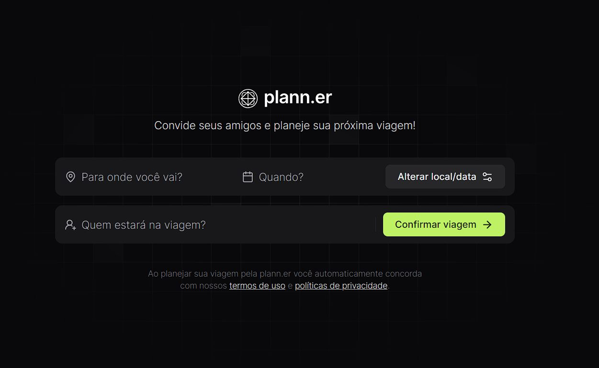

# Planejador de viagem - Trilha React.js pela Rocketseat 
Este projeto foi desenvolvido durante a trilha de React oferecida pela [Rocketseat](https://www.rocketseat.com.br) em 07/2024. O layout foi criado com base no tema no Figma, acessível em [Figma - NLW Journey • Planejador de Viagem (Community)](https://www.figma.com/design/ptundgtvSf6Cty2Hp6WckC/NLW-Journey-%E2%80%A2-Planejador-de-viagem-(Community)).

 


## Guia para rodar o projeto localmente
Siga os passos abaixo para clonar e rodar o projeto em sua máquina.

### Pré-requisitos
- **Node.js** e **npm** instalados na sua máquina.

### Passos

Execute o comando abaixo para instalar as dependências necessárias:

```bash 
npm install
```

Inicie o servidor de desenvolvimento utilizando:

```bash 
npm start

```
ou, se estiver configurado:

```bash 
npm run dev
```

O Vite irá gerar uma URL local para acessar o projeto no navegador.